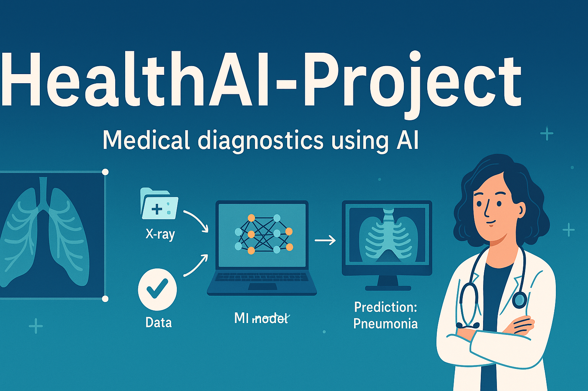
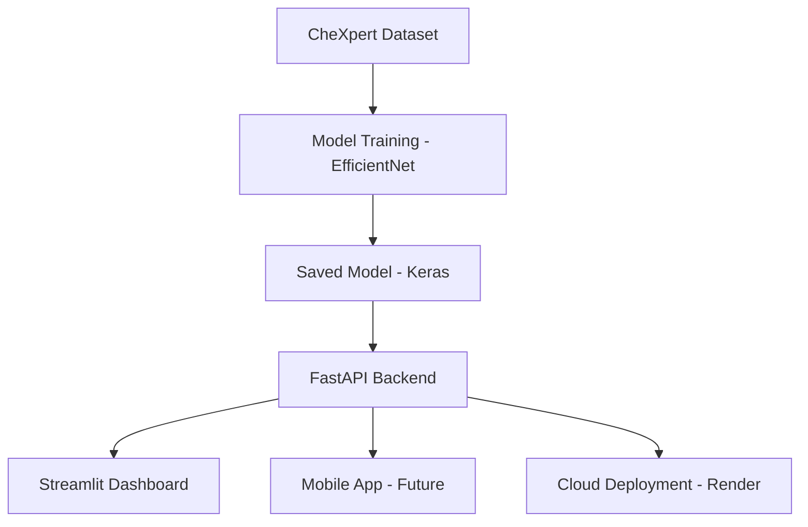
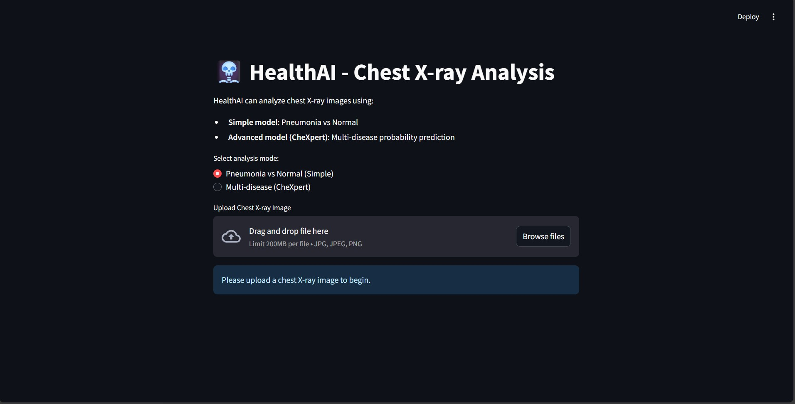
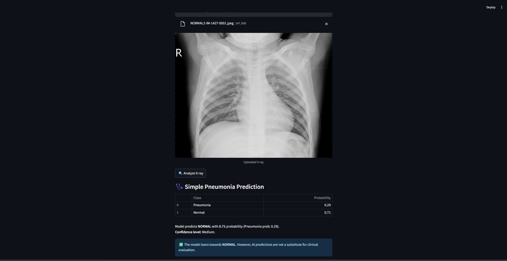
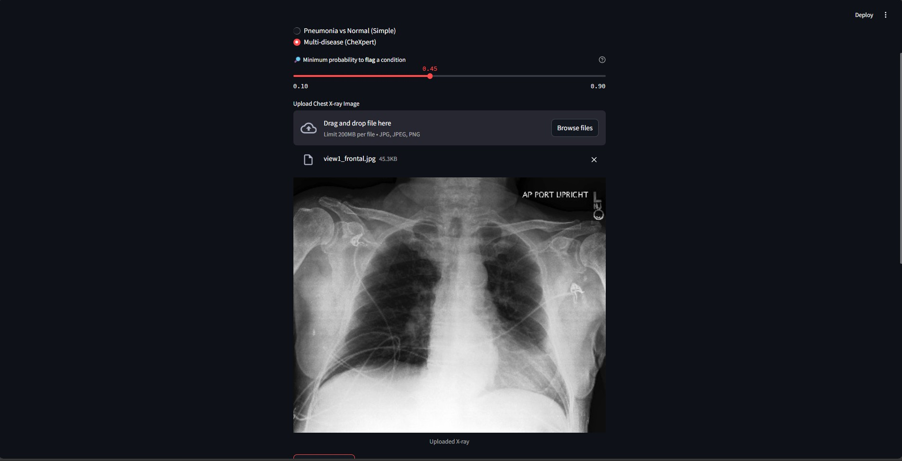
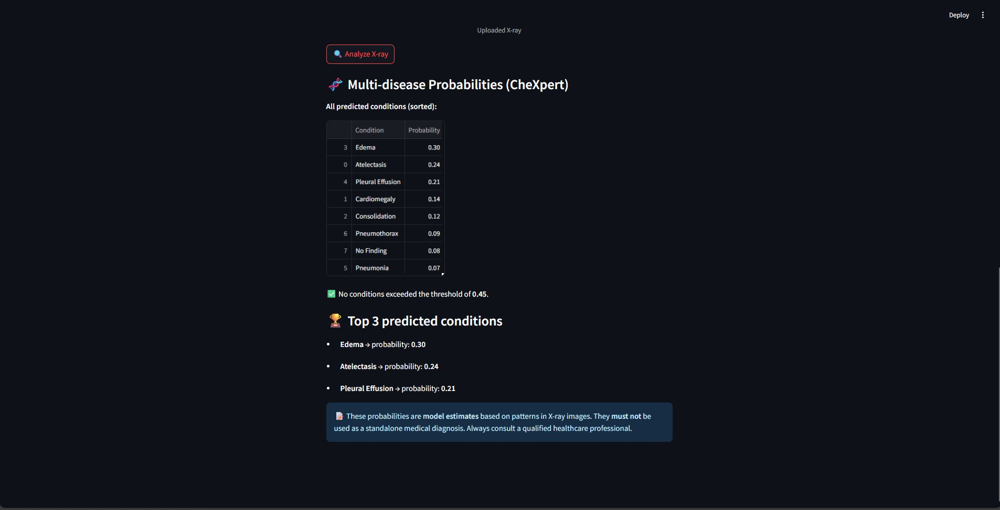

---

# 🫁 **HealthAI – AI-Powered Chest X-Ray Disease Detection System**

*A deep-learning powered platform for multi-disease medical imaging analysis, built with TensorFlow, FastAPI, Streamlit, and deployed on Render.*



---


---

## 🚀 **Overview**

**HealthAI** is an end-to-end medical imaging project that detects **multiple chest diseases** from **X-ray images** using a deep learning model trained on the **CheXpert dataset**.
It features:

*  **Multi-Disease Chest X-Ray Classification** (supports 5+ pathologies)
*  **CNN/Transfer Learning Model (EfficientNetB0)**
*  **FastAPI Backend for AI Inference**
*  **Streamlit Dashboard for Real-time Diagnosis**
*  **Cloud Deployment on Render**
*  **Clean architecture, modular API, scalable structure**

This project demonstrates real-world deep learning workflow:
**data pipeline → model training → evaluation → API → UI → deployment.**

---

##  **Features**

### ✔ 1. **Multi-Label Disease Detection**

Predicts probability for diseases such as:

* Atelectasis
* Cardiomegaly
* Consolidation
* Edema
* Pleural Effusion

Example output:

```json
{
  "Atelectasis": 0.14,
  "Cardiomegaly": 0.02,
  "Consolidation": 0.51,
  "Edema": 0.09,
  "Pleural Effusion": 0.78
}
```

---

### ✔ 2. **FastAPI Backend**

Endpoints:

#### `POST /predict-xray`

* Accepts an uploaded X-ray image
* Returns normalized probabilities for all diseases

#### `GET /health`

Health check endpoint

---

### ✔ 3. **Streamlit Dashboard**

* Upload X-ray image
* Call backend API
* Display disease probabilities in clean UI
* Visual + interactive

---

### ✔ 4. **Cloud Deployment**

Backend deployed on **Render**, accessible publicly.

---

##  **Project Structure**

```
HealthAI-Project/
│
├── backend/
│   ├── main.py
│   ├── model/
│   │   ├── healthai_model.keras
│   │   └── diseases.json
│   └── requirements.txt
│
├── dashboard/
│   ├── app.py
│   └── assets/
│
├── notebooks/
│   ├── 01_train_healthai_model.ipynb
│
├── .gitignore
├── README.md
└── LICENSE
```

---

##  **Live API (Render Deployment)**

Base URL:

```
https://healthai-backend-oj25.onrender.com/
```

Swagger Docs:

```
https://healthai-backend-oj25.onrender.com/docs
```

---

##  **API Reference (Quick Guide)**

### 🔹 **POST /predict-xray**

**Request:**
`multipart/form-data`
field name = `file`

**Response:**

```json
{
  "Atelectasis": 0.14,
  "Cardiomegaly": 0.02,
  "Consolidation": 0.51,
  "Edema": 0.09,
  "Pleural Effusion": 0.78
}
```

### 🔹 **GET /health**

Simple API check.

---

## 🏗 Architecture



---

##  **How to Run Locally**

### 1 Create environment

```bash
conda create -n healthai python=3.10
conda activate healthai
```

### 2️ Install backend dependencies

```bash
cd backend
pip install -r requirements.txt
```

### 3️ Run FastAPI backend

```bash
uvicorn main:app --reload --host 0.0.0.0 --port 8000
```

Docs:
[http://127.0.0.1:8000/docs](http://127.0.0.1:8000/docs)

---

### 4️⃣ Run Dashboard

Open a second terminal:

```bash
cd dashboard
streamlit run app.py
```

Streamlit UI:
[http://localhost:8501/](http://localhost:8501/)

---

## 📸 Screenshots

Add these once screenshots are uploaded:


## DASBOARD



## PNEUMONIA PREDICTION



## MULTIPLE DISEAS PREDICTION





---

## **Model Training Details**

* Dataset: **CheXpert small** (5 diseases)
* Input size: `224x224`
* Base model: **EfficientNetB0**
* Optimizer: **Adam (lr=1e-4)**
* Loss: **Binary Crossentropy**
* Metrics: **AUC, Accuracy**
* Achieved Validation Metrics:

  * **Accuracy: ~88%**
  * **Loss: ~0.27**

---


---

